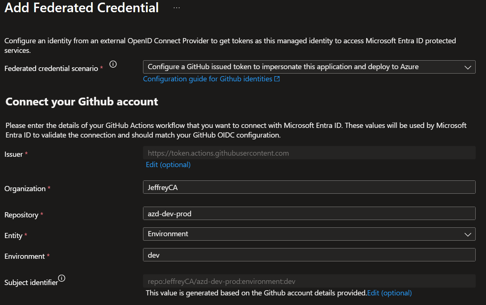
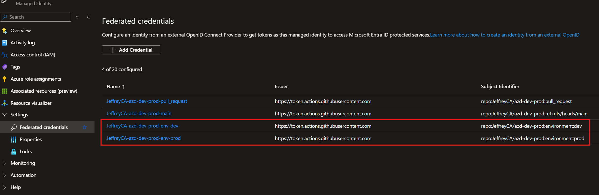

# 🌍 Multi-Region Scale Unit Architecture

This project implements a highly available, multi-region Flask application with automatic failover and global load balancing using Azure services. The infrastructure is organized into **global** and **regional** modules for better maintainability and deployment efficiency.

> [!NOTE]
> Recommended regions: **Poland Central** and **Canada Central** (due to ongoing capacity constraints in other regions)

## 🚀 Quick Start

### Prerequisites
- [Azure Developer CLI (azd)](https://learn.microsoft.com/azure/developer/azure-developer-cli/install-azd)
- [Azure CLI](https://docs.microsoft.com/cli/azure/install-azure-cli) (optional)
- Azure subscription with appropriate permissions

### Quick Deployment

```bash
# Clone and navigate to the project
cd azd-dev-prod

# Deploy using azd (AZURE_ENV_TYPE=dev by default)
azd up

# Or deploy specific environment
azd env set AZURE_ENV_TYPE prod
azd up
```

### GitHub Actions Setup

```bash
# Clone and navigate to the project
cd azd-dev-prod

# Configure CI/CD pipeline
azd pipeline config
```

Follow the interactive prompts:
1. **Environment name**: Enter a unique environment name
2. **Provider**: Select `GitHub`
3. **Azure Subscription**: Choose your target subscription
4. **Primary Location**: Select primary region (recommended: `Canada Central`)
5. **Secondary Location**: Select secondary region (recommended: `Poland Central`)
6. **Authentication**: Select `Federated User Managed Identity (MSI + OIDC)`
7. **User Managed Identity**: Choose to use existing or create new MSI

#### Post-Configuration Steps

After running `azd pipeline config`, you'll need to add environment-specific federated credentials to the User Assigned Managed Identity in Azure:

1. Navigate to your User Assigned Managed Identity resource in the Azure portal
2. Follow the [Microsoft documentation](https://learn.microsoft.com/entra/workload-id/workload-identity-federation-create-trust-user-assigned-managed-identity?pivots=identity-wif-mi-methods-azp#github-actions-deploying-azure-resources) to create federated credentials. **Do this twice for the `dev` and `prod` environments**:
    - **Federated credential scenario**: Configure a GitHub issued token to impersonate this application and deploy to Azure
    - **Entity**: Environment
    - **Environment**: `dev` / `prod`
    

3. Verify you have 4 federated credentials in total:
    

3. **Commit and Push**: After setting up federated credentials, manually trigger the [Deploy workflow](.github/workflows/deploy.yml) or commit your changes to trigger the pipeline

## 🏗️ Architecture Overview

### Infrastructure Organization

Modular Bicep infrastructure:

```
infra/
├── main.bicep                    # Main orchestration (subscription scope)
├── main.parameters.json          # Environment parameters
├── abbreviations.json            # Azure resource naming abbreviations
├── global/                       # Global infrastructure components
│   ├── main.bicep               # Global resources (Front Door, DNS, shared storage)
│   └── front-door-config.bicep  # Front Door endpoint configuration
└── regional/                     # Regional infrastructure components
    ├── main.bicep               # Regional orchestration
    ├── app.bicep                # App Service and hosting
    ├── storage.bicep            # Regional storage
    ├── network.bicep            # VNet and networking
    ├── monitoring.bicep         # Regional monitoring
    └── modules/                 # Additional modules
        ├── applicationinsights-dashboard.bicep  # Application Insights dashboard
        └── vnet-link.bicep      # VNet links for private DNS zones
```

### Deployment Model

- **Multi-Resource Group**: Resources are deployed to separate resource groups (primary, secondary, global)
- **Global Components**: Front Door, DNS zones, and shared storage deployed once to global resource group
- **Regional Components**: App Services, regional storage, and monitoring deployed per region to regional resource groups
- **VNet Integration**: Private DNS zone links created for production environments
- **Service Configuration**: Two azd services (`app-primary` and `app-secondary`) for automatic deployment

### Production Environment (`envType = 'prod'`)

- VNet integration with private endpoints
- Private storage access only
- Private DNS zones with VNet links

```
┌─────────────────────────────────────────────────────────────────────┐
│                           Azure Front Door                          │
│                    (Global Load Balancer + CDN)                     │
└─────────────┬───────────────────────────────────┬───────────────────┘
              │                                   │
    ┌─────────▼─────────┐                ┌─────────▼─────────┐
    │   PRIMARY REGION  │                │  SECONDARY REGION │
    │                   │                │                   │
    │  ┌─────────────┐  │                │  ┌─────────────┐  │
    │  │ App Service │  │                │  │ App Service │  │
    │  │ (VNet Integ)│  │                │  │ (VNet Integ)│  │
    │  └──────┬──────┘  │                │  └──────┬──────┘  │
    │         │         │                │         │         │
    │  ┌──────▼──────┐  │                │  ┌──────▼──────┐  │
    │  │ VNet + Priv │  │                │  │ VNet + Priv │  │
    │  │ Endpoints   │  │                │  │ Endpoints   │  │
    │  └──────┬──────┘  │                │  └──────┬──────┘  │
    │         │         │                │         │         │
    │  ┌──────▼──────┐  │                │  ┌──────▼──────┐  │
    │  │ Storage     │  │                │  │ Storage     │  │
    │  │ (Private)   │  │                │  │ (Private)   │  │
    │  └─────────────┘  │                │  └─────────────┘  │
    └───────────────────┘                └───────────────────┘
              │                                   │
              └─────────────┬─────────────────────┘
                            │
                   ┌────────▼────────┐
                   │ Global Storage  │
                   │ (Shared Config) │
                   └─────────────────┘
```

### Development Environment (`envType = 'dev'`)

- Public storage access with managed identity auth
- No VNet or private endpoints
- Simplified networking for faster deployment

```
┌─────────────────────────────────────────────────────────────────────┐
│                           Azure Front Door                          │
│                    (Global Load Balancer + CDN)                     │
└─────────────┬───────────────────────────────────┬───────────────────┘
              │                                   │
    ┌─────────▼─────────┐                ┌─────────▼─────────┐
    │   PRIMARY REGION  │                │  SECONDARY REGION │
    │                   │                │                   │
    │  ┌─────────────┐  │                │  ┌─────────────┐  │
    │  │ App Service │  │                │  │ App Service │  │
    │  │ (Simplified)│  │                │  │ (Simplified)│  │
    │  └──────┬──────┘  │                │  └──────┬──────┘  │
    │         │         │                │         │         │
    │  ┌──────▼──────┐  │                │  ┌──────▼──────┐  │
    │  │ Storage     │  │                │  │ Storage     │  │
    │  │ (Public +   │  │                │  │ (Public +   │  │
    │  │  MI Auth)   │  │                │  │  MI Auth)   │  │
    │  └─────────────┘  │                │  └─────────────┘  │
    └───────────────────┘                └───────────────────┘
```

## 🔧 Configuration Options

### Environment Variables

| Variable | Description | Default | Example |
|----------|-------------|---------|---------|
| `AZURE_ENV_NAME` | Environment name for resource naming | - | `my-scale-unit` |
| `AZURE_ENV_TYPE` | Environment type (dev/test/prod) | `dev` | `prod` |
| `AZURE_LOCATION` | Primary region | `eastus` | `eastus2` |
| `AZURE_SECONDARY_LOCATION` | Secondary region | `westus2` | `southcentralus` |

### Environment Types

| Environment | Networking | Security | Use Case |
|------------|------------|----------|----------|
| `dev` | Public access with MI auth | Basic | Development, testing |
| `prod` | VNet integration + private endpoints | High | Production workloads |

## 📊 Monitoring & Health Checks

### Built-in Health Endpoints

- **`/health`** - Health check endpoint for Front Door health probes
- **`/info`** - Application information and diagnostics

### Testing Failover

The application includes a **Health Status Control** section on the main page for testing load balancer and Front Door failover:

1. Open Front Door endpoint
2. Click **"Make Unhealthy (120s)"** button
3. Refresh page - traffic should route to the other region

> [!NOTE]
> Alternatively, you can use `az webapp stop --name <app-service-name> --resource-group <resource-group>` to stop one of the apps.

## ️ Infrastructure Details

### Bicep Module Organization

**Main Orchestration (`main.bicep`):**
- Subscription-scoped deployment creating separate resource groups
- Orchestrates global and regional deployments in parallel
- Manages VNet links for private DNS zones in production
- Parameter management and output aggregation

**Global Infrastructure (`global/`):**
- **`main.bicep`**: Front Door profile, private DNS zones, global storage
- **`front-door-config.bicep`**: Endpoint and origin configuration (post-deployment)

**Regional Infrastructure (`regional/`):**
- **`main.bicep`**: Regional orchestration and resource coordination
- **`app.bicep`**: App Service Plan and App Service configuration
- **`storage.bicep`**: Regional storage accounts and containers
- **`network.bicep`**: VNet, subnets, and private endpoints (prod only)
- **`monitoring.bicep`**: Application Insights, Log Analytics, and dashboards
- **`modules/applicationinsights-dashboard.bicep`**: Monitoring dashboard
- **`modules/vnet-link.bicep`**: VNet links to private DNS zones (prod only)

### Deployment Flow

1. **Resource Groups**: Primary, secondary, and global resource groups created
2. **Global Resources**: DNS zones, Front Door profile, shared storage
3. **Regional Resources**: App Services, regional storage, monitoring (parallel deployment)
4. **VNet Links**: Private DNS zone links for production environments
5. **Front Door Configuration**: Endpoints and origins (after App Services are ready)
6. **Application Deployment**: Code deployment to both regions via azd services

## 🔮 Advanced Scenarios

<details>
<summary>🔮 Advanced Scenarios</summary>

### Extending the Architecture

**Adding More Regions:**
1. Modify `main.bicep` to add additional regional deployments
2. Update `azure.yaml` to include new service configurations
3. Configure Front Door origin groups for additional regions

**Custom Domains & SSL:**
1. Configure custom domain in Front Door endpoint
2. Upload SSL certificates or use managed certificates  
3. Update DNS CNAME records to point to Front Door

**Database Integration:**
1. Add Azure SQL Database with geo-replication to `global/main.bicep`
2. Configure connection strings per region in `regional/app.bicep`
3. Implement database failover logic in application code

### Production Hardening

**Security Enhancements:**
- Enable WAF (Web Application Firewall) on Front Door
- Configure App Service IP restrictions to Front Door only
- Add Azure Key Vault for secrets management
- Enable Azure AD authentication

**Performance Optimization:**
- Configure Front Door caching rules
- Enable compression and optimization
- Add Application Gateway for advanced load balancing
- Implement Redis cache for session state

</details>

## 📚 Additional Resources

- [Azure Front Door Documentation](https://docs.microsoft.com/azure/frontdoor/)
- [Azure App Service Multi-Region](https://docs.microsoft.com/azure/app-service/app-service-web-tutorial-content-delivery-network)
- [Azure Developer CLI Documentation](https://learn.microsoft.com/azure/developer/azure-developer-cli/)
- [Azure Well-Architected Framework](https://docs.microsoft.com/azure/architecture/framework/)
